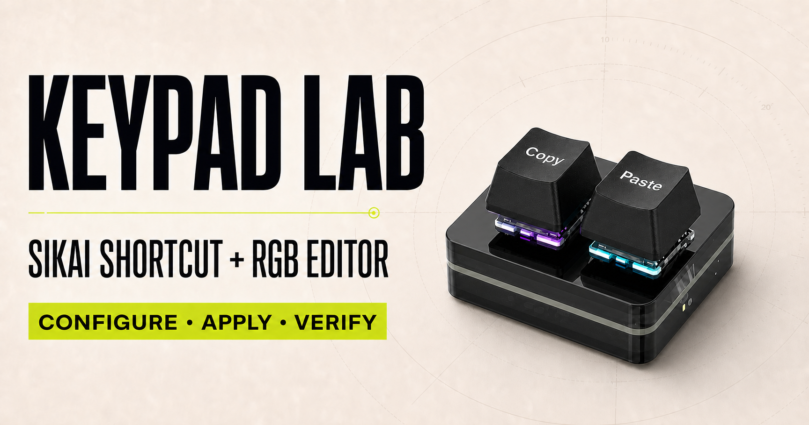

# SIKAI Keypad Lab

[](https://elabar.github.io/SIKAI-Keypad/)

**[Open Keypad Lab and configure your keypad →](https://elabar.github.io/SIKAI-Keypad/)**

A browser-based configurator for the SIKAI two-key RGB keypad. It uses WebHID
to read and update onboard key assignments and supported lighting settings.

Tired of downloading and installing another application just to configure a
two-key keypad? So was I. Keypad Lab lets you configure it directly from a
supported browser.

This project was built and tested for the
[SIKAI two-key Copy/Paste keypad](https://sikaicase.com/products/2-key-copy-paste-keyboard-osu-keypad-hotswap-one-handed-mechanical-gaming-keyboard-backlit-mini-usb-keypad-for-accounting-working-or-rhythm-games-black),
which is also available from this [Shopee listing](https://my.shp.ee/WcEwghiZ).
If you purchased the same model, give it a try.

> [!CAUTION]
> This is an independent, unofficial project. Hardware and firmware revisions
> may differ even when devices look identical. Use it at your own risk and
> confirm the vendor and product IDs before applying changes.

## Requirements

- Windows with a current Chrome or Edge browser
- Bun
- SIKAI keypad with USB vendor ID `0x514C` and product ID `0x8851`

## Development

```bash
bun install
bun run dev
```

## Validation

```bash
bun run lint
bun run test
bun run build:pages
```

## GitHub Pages

Pushes to `main` are validated, built, and deployed to GitHub Pages by
`.github/workflows/deploy-pages.yml`. In the repository settings, set
**Settings → Pages → Source** to **GitHub Actions** before the first deployment.

## Structure

- `lib/sikai-keypad/` — reusable WebHID device and protocol implementation
- `stores/keypad-store.ts` — Zustand session state and namespaced actions
- `components/` — connection, assignment, RGB, and diagnostic UI
- `app/` — application shell and styles

The deployed configurator uses `.openai/hosting.json` for its Sites project
binding.
